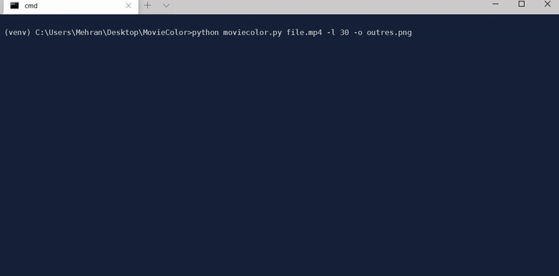

# MovieColor

Get an average color of video frames each in a bar like this example:


## Usage:

Install python dependencies in Virtual Environment:
```
python -m venv venv
venv\Scripts\activate (on Windows)
source venv/bin/activate (on Linux)
pip install -r requirements.txt
```
Run it with:
```
python moviecolor.py input.mp4 [-l 30] [-o output_name] [--help]
```
>-l , --length: chosen part of the video from start (in Minutes)


